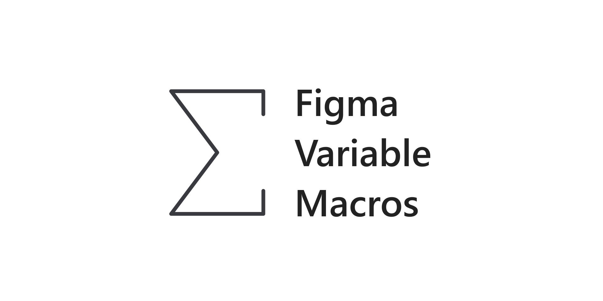
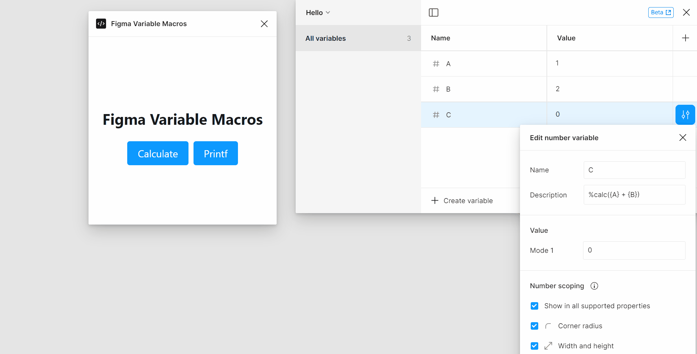
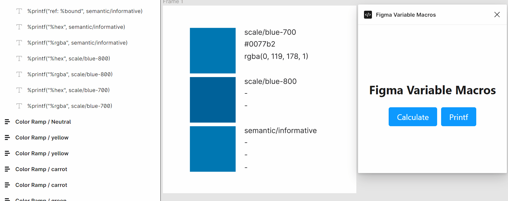
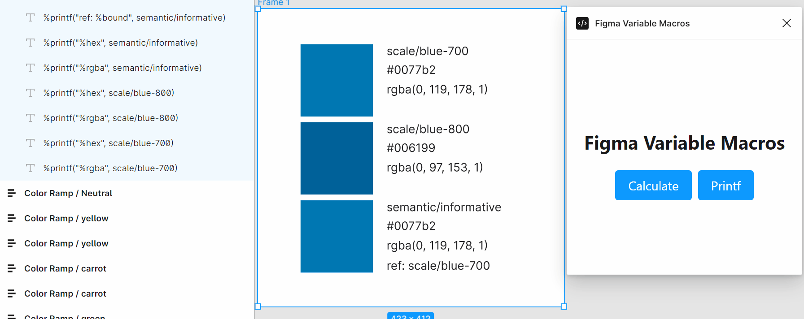

# Figma Variable Macros

> Unleash the potential power of Figma Variables

## Variable Formula

Ever find yourself needing a bit of magic to implement layout values calculated from design tokens? Wondering how you can maintain your design intent in these situations? Variable Formula is the solution: They enable computation from your design tokens, ensuring your design intent remains steadfast and clear.

- +, -, \*, /, ^, (, ) are supported.

### Instruction

1. Navigate to the variable you want to apply the formula to, and open the "Edit variable" panel.
2. In the "Description" field, type `%calc({A} + {B})`. The plugin will automatically detect the variable names between {}.
3. Open `Figma Variable Macros` plugin.
4. Click `Calculate` button.
5. Check out the result.

## Variable Printf

Tired of the exhausting task of documenting design tokens on Figma? Finding it painful to display raw values and maintain synchronization? It's time to bring in a tried-and-true method. Welcome the age-old 'printf' into your Figma workflow, one-click display synchronization of design token values.

- You can print the variable information to the text node.
- Printed information follows the resolved mode where the text node is located.

### Instruction

1. Navigate to the text node you want to print the variable information to.
2. Rename text node to `%print("%hex", VARIABLE_NAME)`.
3. Open `Figma Variable Macros` plugin.
4. Click `Printf` button.
5. Check out the result.

### Supported formats

| syntax | description                                                       |
| ------ | ----------------------------------------------------------------- |
| %hex   | Print hexadecimal color code                                      |
| %rgba  | Print `rgba(r, g, b, a)`                                          |
| %r     | Print red value of Color variable (0~255)                         |
| %g     | Print green value of Color variable (0~255)                       |
| %b     | Print blue value of Color variable (0~255)                        |
| %a     | Print alpha value of Color variable (0~1)                         |
| %bound | If variable is aliasing other variable, print bound variable name |
